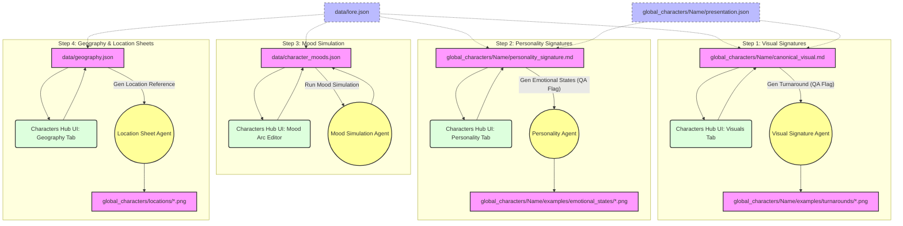
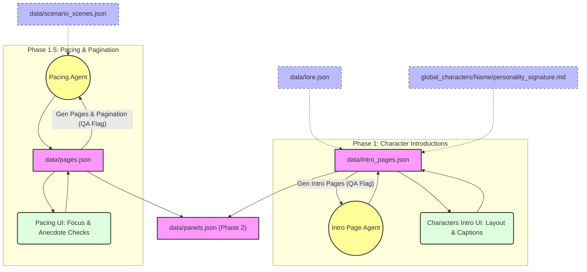
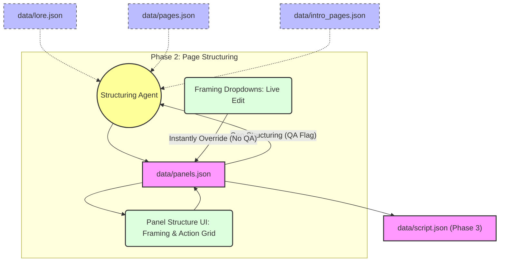
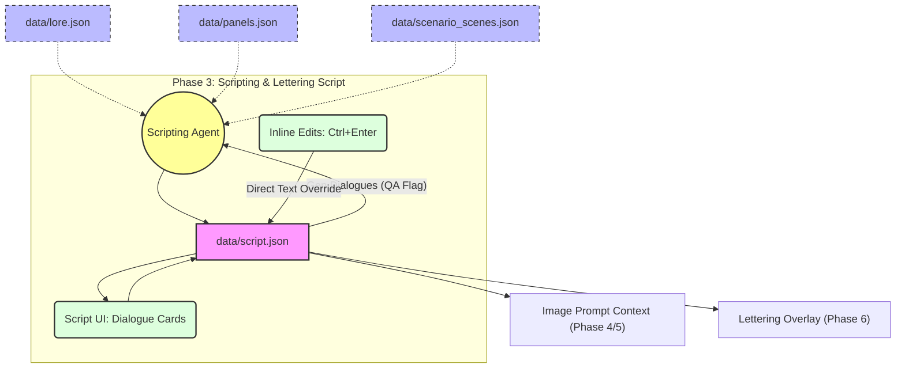
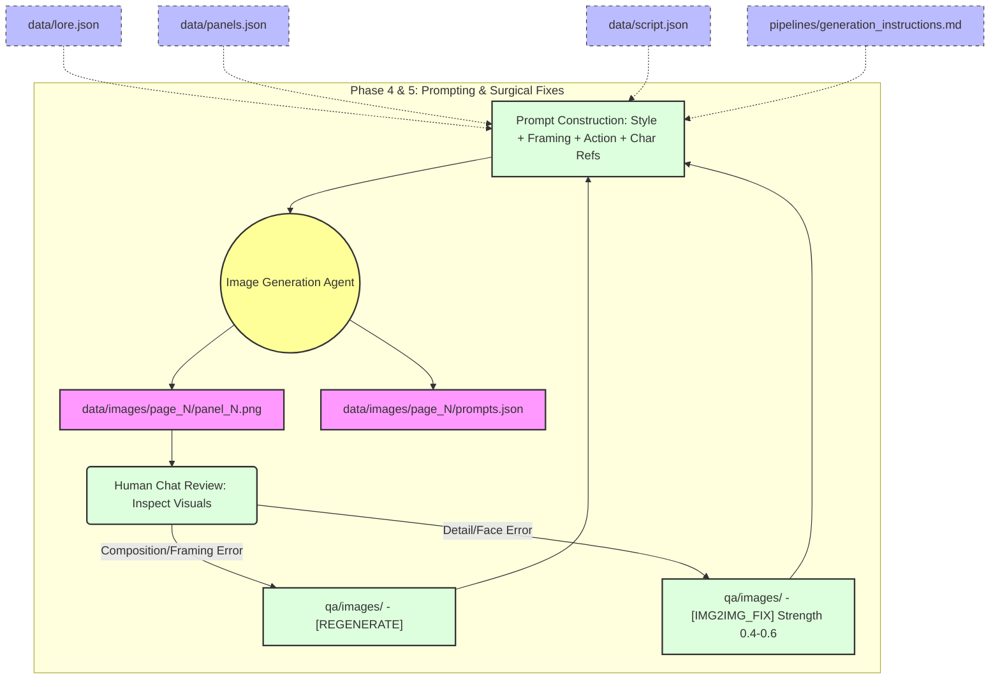
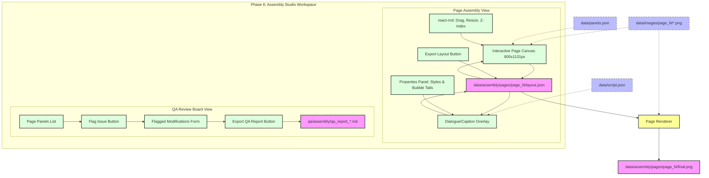

# Comic Studio 3.0: Pipeline Flow Architectures

This guide describes the data flow, agent interactions, and user interface controls for each page of the app (excluding the Scenario page).

---

## 1. Phase 0.5: Character Hub & Location Sheets

The Character Hub builds the baseline assets and behavioral models for character personality, visual appearance, scene moods, and scene geography. It translates raw concepts into deterministic profiles.

### Data Schema Overview
- **Visual Turnarounds:** Output is a markdown profile `global_characters/[Name]/canonical_visual.md` and reference turnarounds in `global_characters/[Name]/examples/turnarounds/`.
- **Personality Signatures:** Output is `global_characters/[Name]/personality_signature.md` with 12 distinct emotional state visuals in `characters/[Name]/examples/emotional_states/`.
- **Mood Simulation:** Simulates character emotional paths across the scenario scenes, exporting to `data/character_moods.json`.
- **Geographic location sheets:** Maps scene settings and coordinates, exporting to `data/geography.json`.

### Pipeline Flow Diagram

---

## 2. Phase 1 & 1.5: Pacing & Character Intro (Parallel)

Once the core script breakdown (`data/scenario_scenes.json`) is approved, pagination runs in parallel with dedicated character intro generation. Both outputs must be finalized before structural panel division occurs.

### Data Schema Overview
- **Intro Pages:** Maps splash layout types to exact panel numbers for main characters (`data/intro_pages.json`).
- **Pacing List:** Maps scenes onto physical pages with anecdote indicators, totals, and focusing descriptions (`data/pages.json`).

### Pipeline Flow Diagram

---

## 3. Phase 2: Panel Structuring

This phase divides page focal descriptions into individual panel layout structures. It lists framing, characters present, visual actions, and structural metadata tags.

### Camera Framing & Custom Overrides
- **Camera Angles:** Restricts values to standard options (`Close-up`, `Wide Establishing Shot`, `POV shot`, etc.).
- **Live Overrides:** Users can change panel framing directly in the dropdown. This is saved instantly to the database and does not trigger QA reports.

### Pipeline Flow Diagram

---

## 4. Phase 3: Scripting

Generates and validates dialogue overlays, thought bubbles, and narrator captions. The output is referenced permanently for downstream layout and lettering.

### Critical Rules
- **Unique Dialogue ID:** Structured as `d_[page]_[panel]_[index]` (e.g., `d_2_3_1`). These IDs are permanent.
- **Modifications Constraints:** Renumbering on deletions or edits is prohibited to avoid breaking layout coordinates.

### Pipeline Flow Diagram

---

## 5. Phase 4 & 5: Image Generation & Surgical Review

Generates high-fidelity artwork matching the panel breakdown. Features a manual chat-driven review loop for modifying and fixing individual panels before compositing.

### Image prompt construction
- Prompts are built by concatenating style baselines, framing translations, panel actions, character descriptions, and tag descriptors.
- Modifications trigger either targeted `[IMG2IMG_FIX]` (denoising 0.4–0.6) or complete `[REGENERATE]` instructions.

### Pipeline Flow Diagram

---

## 6. Phase 6: Page Assembly

The final layout phase where panel frames and lettering dialogue bubbles are composited onto pages. It provides a visual layout editor and a dedicated QA Review Board.

### Studio Editor Capabilities
- **Page Assembly:** Drag-and-drop components, placement sizing, ordering overlays, editing lettering text styling and vector tails.
- **QA Review Board:** Sub-view for flagging panels, assigning modification types, and exporting QA markdown logs.

### Pipeline Flow Diagram

