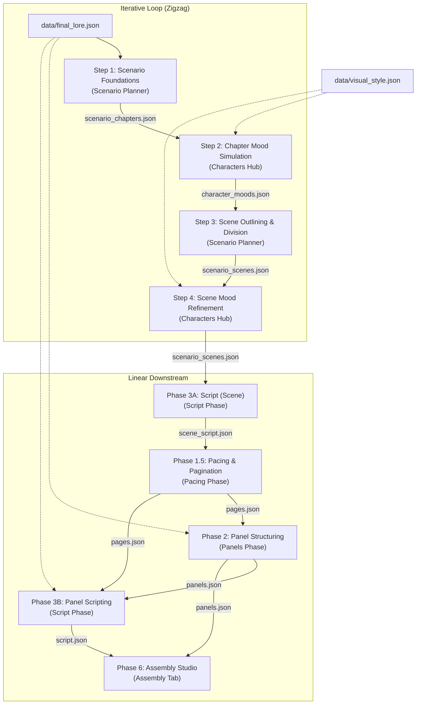

# Comic Studio 3.0: Compilation Pipeline and Workflow Guide

This document serves as the master specification of the compilation pipeline for future AI coding agents working in this workspace. It outlines the exact data sequence, database file dependencies, and the iterative "zigzag" loop between the Scenario and Character Hub editors.

---

## 1. Pipeline Overview: The Zigzag & Linear Flow

Comic book generation is divided into two segments:
1. **The Iterative Loop (Steps 1–4)**: A back-and-forth orchestration between `Scenario Planner` and `Characters Hub` to gradually align characters' emotional beats with narrative pacing.
2. **The Linear Compilation (Phases 3A–6)**: A downstream pipeline that translates the scenes outline into detailed scene-level scripting, pagination pacing, panel structuring, panel scripting (in parallel), and layout lettering.



---

## 2. Detailed Pipeline Steps

### Step 1: Scenario: Foundations (Scenario Planner)
* **Description**: Takes theme inputs and writes the master synopsis, registers core characters, and generates the initial chapter grid.
* **Workspace**: [ScenarioPhase](file:///c:/Users/Users/Desktop/Emy%20christmass/architecture%203.0/app/src/components/phases/scenario/ScenarioPhase.tsx)
* **Associated Agent**: `Scenario Architect Agent`
* **Input Files**: 
  * `data/user_lore.json` (defines factions, parameters)
  * `data/scenario_inputs.json` (theme prompts)
* **Output Files**:
  * `data/personality_signature.json` (base character archetypes)
  * `data/scenario_synopsis.json` (approved synopsis)
  * `data/scenario_chapters.json` (structural chapter titles & outlines)

### Step 2: Characters: Chapter Moods (Characters Hub)
* **Description**: Simulates and tracks characters' core emotional metrics (e.g. Valence, Anger, Fear, Joy) across the chapter lists created in Step 1.
* **Workspace**: [CharacterHubPhase](file:///c:/Users/Users/Desktop/Emy%20christmass/architecture%203.0/app/src/components/phases/character-hub/CharacterHubPhase.tsx)
* **Associated Agent**: `Mood Simulation Agent`
* **Input Files**:
  * `data/final_lore.json`, `data/visual_style.json`
  * `data/personality_signature.json`
  * `data/scenario_chapters.json` (defines the timeline axis)
* **Output Files**:
  * `data/character_moods.json` (chapter-level emotional vectors)

### Step 3: Scenario: Scene Division (Scenario Planner)
* **Description**: Breaks down chapter outlines into granular, beat-by-beat scene descriptions, incorporating chapter-level character moods as narrative guidelines.
* **Workspace**: [ScenarioPhase](file:///c:/Users/Users/Desktop/Emy%20christmass/architecture%203.0/app/src/components/phases/scenario/ScenarioPhase.tsx)
* **Associated Agent**: `Scene Outliner Agent`
* **Input Files**:
  * `data/scenario_chapters.json`
  * `data/character_moods.json`
* **Output Files**:
  * `data/scenario_scenes.json` (scene indexes, characters involved, summaries, settings)

### Step 4: Characters: Scene Moods (Characters Hub)
* **Description**: Translates chapter moods into scene-level precision. Simulates turnarounds, visual looks, and character visual profiles.
* **Workspace**: [CharacterHubPhase](file:///c:/Users/Users/Desktop/Emy%20christmass/architecture%203.0/app/src/components/phases/character-hub/CharacterHubPhase.tsx)
* **Associated Agent**: `Visual Signature Agent`
* **Input Files**:
  * `data/scenario_scenes.json`
  * `data/personality_signature.json`
  * `data/visual_style.json`
  * `data/character_moods.json` (previous pass data)
* **Output Files**:
  * `data/character_moods.json` (overwritten with scene-level specificity)
  * Character profiles in `global_characters/[Name]/personality_signature.md`

---

## 3. Downstream Linear Compilation

### Phase 3A: Script (Scene) (Script Phase)
* **Description**: Writes narrative scene-level script beats: dialogues, narrations, SFX, and silences.
* **Workspace**: [ScriptPhase](file:///c:/Users/Users/Desktop/Emy%20christmass/architecture%203.0/app/src/components/phases/script/ScriptPhase.tsx)
* **Associated Agent**: `Scene Writer Agent`
* **Input Files**:
  * `data/scenario_scenes.json`
  * `data/final_lore.json`
  * `data/script_style.json`
* **Output Files**: `data/scene_script.json`

### Phase 1.5: Pacing & Pagination (Pacing Phase)
* **Description**: Takes the written scene script beats and divides them into physical comic pages. Sets page layout constraints, focus points, and pacing variables.
* **Workspace**: [PacingPhase](file:///c:/Users/Users/Desktop/Emy%20christmass/architecture%203.0/app/src/components/phases/pacing/PacingPhase.tsx)
* **Associated Agent**: `Layout Pagination Agent`
* **Input Files**: `data/scene_script.json`
* **Output Files**: `data/pages.json`

### Phase 2: Panel Structuring (Panels Phase)
* **Description**: Divides page budgets into configurations of panels. Outlines camera positioning (Wide, Close-up, Low-angle), focus characters, and framing bounds, guided by the scene script.
* **Workspace**: [PanelsPhase](file:///c:/Users/Users/Desktop/Emy%20christmass/architecture%203.0/app/src/components/phases/panels/PanelsPhase.tsx)
* **Associated Agent**: `Panel Composition Agent`
* **Input Files**:
  * `data/pages.json`
  * `data/intro_pages.json`
  * `data/final_lore.json`
  * `data/panel_style.json`
  * `data/scene_script.json`
* **Output Files**: `data/panels.json`

### Phase 3B: Panel Scripting (Script Phase - Parallel with Phase 2)
* **Description**: Maps scene beats to panels, determines reading flow, acting directions, and bubble placement details.
* **Workspace**: [ScriptPhase](file:///c:/Users/Users/Desktop/Emy%20christmass/architecture%203.0/app/src/components/phases/script/ScriptPhase.tsx)
* **Associated Agent**: `Panel Script Agent`
* **Input Files**:
  * `data/scene_script.json`
  * `data/panels.json`
  * `data/script_style.json`
  * `data/final_lore.json`
* **Output Files**: `data/script.json`

### Phase 6: Page Assembly (Assembly Studio)
* **Description**: The final layout studio where lettering (bubbles, captions, sound effect blocks) is adjusted on a drag-and-drop canvas.
* **Workspace**: [Canvas](file:///c:/Users/Users/Desktop/Emy%20christmass/architecture%203.0/app/src/components/editor/Canvas.tsx) and [App](file:///c:/Users/Users/Desktop/Emy%20christmass/architecture%203.0/app/src/App.tsx)
* **Associated Agent**: `Page Compilation Engine`
* **Input Files**:
  * `data/script.json`
  * `data/panels.json`
* **Output Files**: `outputs/pages/page_[N]/layout.json` (contains absolute layout elements coordinates)

---

## 4. Verification and UI Component Guidelines

When modifying phase views or backend integrations, follow these constraints:
1. **Always run a production build test** after edits:
   ```bash
   cd app
   npm run build
   ```
2. **Phase Header Standard**: Every phase workspace must start with a `<PhaseHeader>` child component containing `title`, `emoji`, `badge`, `description`, `inputs`, and `outputs` properties.
3. **Data persistence**: Data is loaded/saved using the Vite server proxy middleware. Always check `/api/load?path=...` and `/api/save` calls in the workspace config (`vite.config.ts`).
