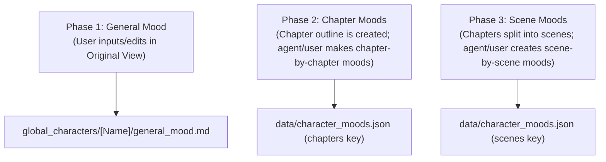

# Character Personality & 3-Phase Mood System

We are redesigning the character personality signature and emotional mood tracking systems to allow distributed storage per character and support a 3-phase, high-granularity emotional flow. This integrates directly with the story scenario's chapters and scenes.

## Core Architectural Changes

### 1. Distributed Personality Signatures
Instead of a single centralized `data/personality_signature.json`, each character now has their own local, project-specific personality configuration:
- **Path:** `data/characters/[Name]/personality_signature.json`
- **Structure:** Wraps the character's properties under the character's name key for backwards-compatibility.
- **Visual Mapping:** The Scenario Signatures tab (React Flow graph) dynamically reads individual files, merges them for the canvas display, and saves changes back to each character's specific file.

### 2. 3-Phase Mood Making & Complex Emotions
We are implementing the character mood tracking system in 3 progressive phases:

- **Complex Emotions:** We are removing the strict limitation of 12 canonical emotions. The UI will support free-form complex emotions (e.g. "bittersweet relief", "nostalgic dread", "quiet melancholia") while still suggesting the 12 core emotions via an autocomplete datalist.
- **Emoji Mapping:** A smart emoji-matching resolver maps complex emotion strings to matching canonical emojis, falling back to a general mask `🎭` emoji for new, custom nuances.

---

## Component Updates

### 1. Character Hub: Original View (`OriginalView.tsx`)
- **General Mood & Headspace:** Add a premium markdown-friendly long-form editor to load, display, and save `global_characters/[Name]/general_mood.md` directly.
- **Dynamic Save:** Writes the markdown file using the `/api/save-qa` endpoint (which automatically creates the parent folders if missing).

### 2. Character Hub: Mood Arc Tab (`CharacterHubPhase.tsx`)
- **Level Toggle:** Add a high-fidelity control tab at the top of the timeline:
  - **Chapter-level Moods** (loads and saves to `moodsData.chapters` using `scenario_chapters.json` as the outline).
  - **Scene-level Moods** (loads and saves to `moodsData.scenes` using `scenario.json` as the outline).
- **Free-Form Emotion Input:** Replace the emotion dropdown with an autocomplete `<input list="...">` to allow arbitrary complex emotions.
- **Save Hooks:** Ensure saves update the correct slice (`chapters` vs `scenes`) in `data/character_moods.json`.

### 3. Scenario: Signatures Tab (`ScenarioPhase.tsx`)
- **Dynamic Aggregation:** Discover all characters by listing `global_characters/`, `data/characters/`, and loading `data/lore.json`.
- **Parallel Loading:** Fetch individual signature files asynchronously and merge them into a single virtual `signatures` structure.
- **Targeted Saving:** Write changes only to the files of the characters whose signatures were modified.

---

## Verification Plan

### Automated Verification
- Verify compilation of all updated components using the build script.
- Verify JSON validation logic for loaded character folders.

### Manual Verification
- Test selecting various characters in the Character Hub and verify:
  1. Editing the General Mood writes correctly to `global_characters/[Name]/general_mood.md`.
  2. The Mood Arc toggle successfully switches between Chapter Moods and Scene Moods.
  3. Adding a complex emotion (e.g. "nostalgic sadness") saves to `data/character_moods.json` and updates the timeline with a fallback/matching emoji.
  4. Editing a character signature in the Scenario flow canvas writes to `data/characters/[Name]/personality_signature.json`.

