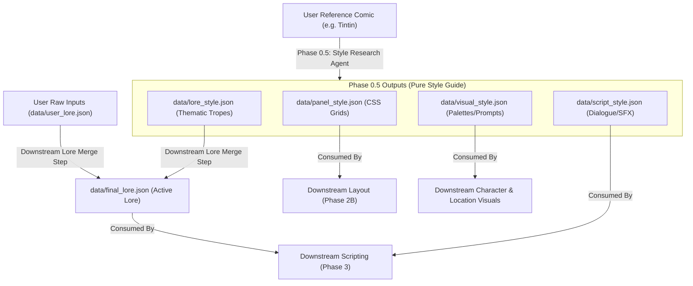

# Agent Handoff: Style Research & Modular Lore Architecture

This document serves as a complete handoff for the next agent to resume development on the **Architecture 3.0** comic studio application. It outlines the state of the project, key architectural patterns, templates created, and the exact next steps.

---

## 1. Project Goal & Design Vision
The user wants to adapt **any reference comic book style** (visual and narrative conventions) to their own custom story/characters/events. The system must support this style injection cleanly, ensuring it heavily impacts the aesthetic and narrative structure without distorting the user's core story details.

To achieve this, the architecture separates **Style Research (Phase 0.5)** from **Lore Merging (Downstream Phase)**:
1. **Phase 0.5 (Style Research)**: Extracts raw visual and narrative tropes from a reference comic (e.g. *Tintin*) and saves them as independent style files.
2. **Lore Merging**: A downstream step that takes the user's raw story ideas (`user_lore.json`) and the researched tropes (`lore_style.json`), blending them into the active `final_lore.json` which then propagates to scripting and layout.

---

## 2. File and Directory Registry

### Newly Created Templates
Located in [data/templates/](file:///c:/Users/Users/Desktop/Emy%20christmass/architecture%203.0/data/templates/):
*   [user_lore_template.json](file:///c:/Users/Users/Desktop/Emy%20christmass/architecture%203.0/data/templates/user_lore_template.json): Schema for the user's raw, unpolished story and world ideas.
*   [lore_style_template.json](file:///c:/Users/Users/Desktop/Emy%20christmass/architecture%203.0/data/templates/lore_style_template.json): Schema for the researched thematic/narrative tropes and archetypes extracted from the reference comic.
*   [final_lore_template.json](file:///c:/Users/Users/Desktop/Emy%20christmass/architecture%203.0/data/templates/final_lore_template.json): Schema for the final combined lore, merging the user's story with the researched style.
*   [visual_style_template.json](file:///c:/Users/Users/Desktop/Emy%20christmass/architecture%203.0/data/templates/visual_style_template.json): Schema for aesthetic design tokens, palettes, and baseline image diffusion prompts.

### Reference Style Outputs (Tintin)
Located in [data/](file:///c:/Users/Users/Desktop/Emy%20christmass/architecture%203.0/data/):
*   [panel_style.json](file:///c:/Users/Users/Desktop/Emy%20christmass/architecture%203.0/data/panel_style.json): A complete visual styling guide for Hergé's *ligne claire* style (4-row grid rules, borders, gutters, proportions, and 7 CSS grid signature patterns).
*   [script_style.json](file:///c:/Users/Users/Desktop/Emy%20christmass/architecture%203.0/data/script_style.json): A complete narrative styling guide for *Tintin* (moderate dialogue density, Snowy-only thought balloons, hand-drawn SFX rules, slapstick pacing, and 7 explicit anti-patterns).

### Pipelines Modified
*   [09b_style_research.md](file:///c:/Users/Users/Desktop/Emy%20christmass/architecture%203.0/pipelines/09b_style_research.md): Updated to explicitly outputs four files (`panel_style.json`, `script_style.json`, `lore_style.json`, and `visual_style.json`), separating research extraction from downstream lore merging.

---

## 3. Workflow Flowchart


---

## 4. Instructions for the Incoming Agent

1.  **Do NOT overwrite existing active data files** unless explicitly directed by the user (leave `data/lore.json` and `data/visual_style.json` intact or only update them via the official merged pipeline).
2.  **Verify JSON validity** of templates and target files whenever edits are made using:
    ```powershell
    node -e "JSON.parse(require('fs').readFileSync('path/to/file.json'))"
    ```
3.  **Implement the Downstream Lore Merge Pipeline**:
    *   Create a pipeline or script that merges `data/user_lore.json` (user inputs) and `data/lore_style.json` (researched tropes) into `data/final_lore.json`.
    *   This merge should preserve the core story characters and conflicts of the user, but map characters to the style archetypes and inject the thematic tropes of the style.
4.  **Align with App Integration**:
    *   Ensure any front-end components that display or modify lore or styles are updated to support the new JSON paths (`user_lore.json`, `lore_style.json`, `final_lore.json`, and `visual_style.json`).
