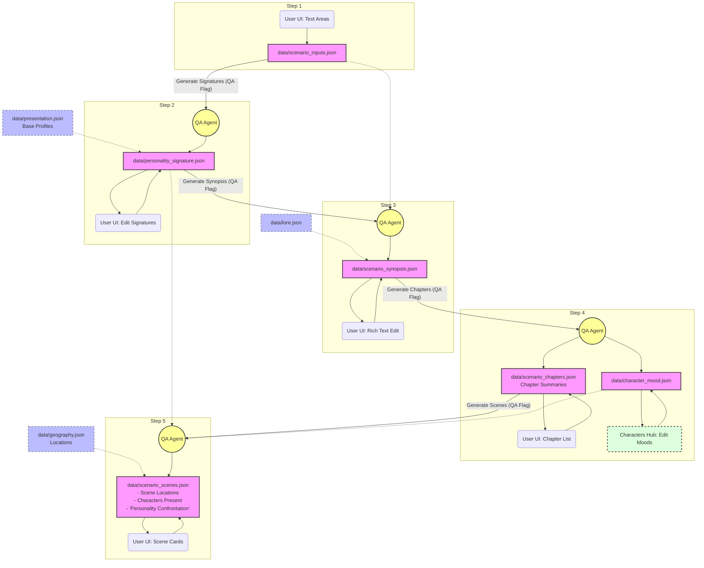

# Scenario Pipeline Architecture & Handoff

**Context:** 
We are refactoring the "Lore & Story -> Scenario" generation process in the Assembly Studio. 
Currently, the process jumps straight from raw data to a finished scene-by-scene script (`scenario.json`), behaving like a black box. 
We are replacing this with a **5-step controllable pipeline** where the user can steer the narrative, edit intermediate outputs, and trigger agent generation (via the established QA Flagging system) at every level of granularity.

---

## The 5-Step Pipeline Architecture

### Step 1: Raw Inputs (The Brain Dump)
- **Input Required:** User manual entry of logline, themes, and a list of specific anecdotes/plot points/jokes.
- **Modifications Possible:** Add, remove, or edit the bullet points directly in the UI.
- **Output:** Saves to `data/scenario_inputs.json`.

### Step 2: Personality Signatures
- **Input Required:** `data/scenario_inputs.json` + `data/presentation.json` (Base Character Profiles).
- **Process:** Based on the scenario's raw inputs and the base character profiles, the agent generates specific personality signatures tailored to this scenario's events.
- **Modifications Possible:** The user has a dedicated editing phase to manually refine and adjust each character's `personality_signature`.
- **Output:** Saves to `data/personality_signature.json`.

### Step 3: The Story Treatment (Synopsis)
- **Input Required:** `data/scenario_inputs.json` + `data/personality_signature.json` + `data/lore.json`.
- **Modifications Possible:** Direct rich-text editing of the generated synopsis. Users can also flag the entire synopsis or specific paragraphs for a QA rewrite.
- **Output:** Saves to `data/scenario_synopsis.json`.

### Step 4: Chapters (The Outline)
- **Input Required:** `data/scenario_synopsis.json`.
- **Modifications Possible:** 
  - Drag-and-drop to reorder, add, or delete chapters.
  - Flag individual chapters for a QA rewrite or expansion.
- **Output:** Saves to two distinct files:
  - `data/scenario_chapters.json` (The plot outline)
  - `data/character_mood.json` (The character's overarching mood in each chapter). *Note: The user will primarily edit this file in the **Characters Hub** panel.*

### Step 5: Scenes (The Script Breakdown)
- **Input Required:** `data/scenario_chapters.json` + `data/personality_signature.json` + `data/character_mood.json` + `data/geography.json` (Locations).
- **Modifications Possible:**
  - Modify the scene's location, summary, and the characters present.
  - Tweak the specific character mood for that scene.
  - **Personality & Mood Confrontation:** Flag a scene to ask the QA agent to verify it: *"Does this scene contradict CHARACTER_A's `personality_signature` or their inherited `character_mood` for this chapter?"* 
  - Flag for rewrite, split scenes, add scenes after.
- **Output:** Saves to `data/scenario_scenes.json` (replacing the old `scenario.json`).

---

## Implementation Checklist for the Next Agent

### 1. Data Schema Updates (`app/src/types/data.ts`)
- Define TypeScript interfaces for the new JSON files:
  - `ScenarioInputsData`
  - `PersonalitySignatureData`
  - `ScenarioSynopsisData`
  - `ScenarioChaptersData`
  - `CharacterMoodData`
  - `ScenarioScenesData` (Adapt the old `ScenarioData` interface)

### 2. UI Component Architecture (`ScenarioBuilder.tsx`)
- Create a new wrapper component `ScenarioBuilder.tsx` to orchestrate the 5 steps via a stepper or accordion UI.
- Ensure clicking "Generate" dispatches a **QA Flag** (e.g., `flagTarget: 'scenario_synopsis'`) for the background python agent, maintaining a non-blocking UI.
- Build sub-components for each of the 5 steps, ensuring they can save state locally and persist back to the backend.

### 3. Characters Hub Integration
- The existing Characters Hub must be updated to load and edit `data/character_mood.json` directly.

### 4. Backend / Python Agent Scripts Updates
- The Phase 0 python scripts in the `pipelines/` or backend directory must be updated to:
  1. Handle intermediate QA generation flags (`GENERATE_SIGNATURES`, `GENERATE_SYNOPSIS`, etc.).
  2. Parse and write to the new separated JSON files.
  3. **Crucial Rule:** The Step 5 agent prompt must explicitly cross-reference the scene actions against the Character's `personality_signature` and `character_mood.json` to ensure deep psychological consistency.

---

## Pipeline Data Flow Diagram

