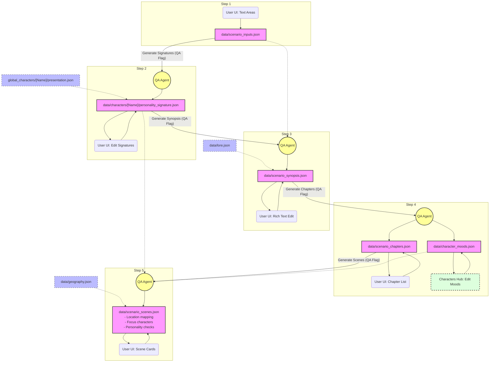

# Reference: Controllable 5-Step Scenario Generation Pipeline

This document details the architectural design, file flow, and agent coordination protocols for the **5-step controllable scenario generation pipeline**. This pipeline allows human operators and AI agents to guide, refine, and verify narrative outputs at multiple levels of granularity.

---

## 1. Architectural Overview

Instead of generating a scene-by-scene script directly from raw text, the story development process is broken down into five distinct, sequential steps. Each step exposes its intermediate output to the user interface, enabling manual editing and targeted AI regeneration using **QA Flags**.

```
  Step 1: Inputs ──► Step 2: Signatures ──► Step 3: Synopsis ──► Step 4: Chapters ──► Step 5: Scenes
```

---

## 2. Detailed Step Specifications

### Step 1: Raw Inputs
- **Goal:** Capture the core narrative direction, constraints, and source materials.
- **Inputs:** User manual input in the UI (Logline, Themes, Anecdotes, Notes).
- **Outputs:** [scenario_inputs.json](file:///c:/Users/Users/Desktop/Emy%20christmass/architecture%203.0/data/scenario_inputs.json)
- **User Actions:** Directly edit bullet points, themes, and goals in the UI editor.

### Step 2: Personality Signatures
- **Goal:** Distill project-specific psychology, verbal styles, and relationship grids for each character.
- **Inputs:** `scenario_inputs.json` + `global_characters/[Name]/presentation.json` + `data/lore.json`.
- **Outputs:** [data/characters/[Name]/personality_signature.json](file:///c:/Users/Users/Desktop/Emy%20christmass/architecture%203.0/data/characters) (Project-specific character configurations).
- **User Actions:** Add, edit, or delete character relationships and dynamics using the interactive **Relationship Tree Graph** and details editor.
- **Agent Pipeline Script:** [pipelines/06_personality_signature.md](file:///c:/Users/Users/Desktop/Emy%20christmass/architecture%203.0/pipelines/06_personality_signature.md).

### Step 3: Story Treatment (Synopsis)
- **Goal:** Develop the complete plot summary and overarching narrative flow.
- **Inputs:** `data/scenario_inputs.json` + `data/characters/[Name]/personality_signature.json` + `data/lore.json`.
- **Outputs:** [scenario_synopsis.json](file:///c:/Users/Users/Desktop/Emy%20christmass/architecture%203.0/data/scenario_synopsis.json)
- **User Actions:** Read and edit the text outline. Write instructions to flag paragraphs or the full synopsis for AI rewrites.
- **Agent Pipeline Script:** [pipelines/03_scenario_development.md](file:///c:/Users/Users/Desktop/Emy%20christmass/architecture%203.0/pipelines/03_scenario_development.md).

### Step 4: Chapters (Outline)
- **Goal:** Divide the synopsis into structured chapter beats and map character emotional arcs.
- **Inputs:** `data/scenario_synopsis.json` + `data/lore.json`.
- **Outputs:**
  - [scenario_chapters.json](file:///c:/Users/Users/Desktop/Emy%20christmass/architecture%203.0/data/scenario_chapters.json) (Chapter outlines and summaries).
  - [character_moods.json](file:///c:/Users/Users/Desktop/Emy%20christmass/architecture%203.0/data/character_moods.json) (Overarching character moods per chapter).
- **User Actions:**
  - Drag-and-drop to reorder, add, or delete chapters.
  - Modify character mood levels (Anger, Fear, Valence, Tension) in the **Characters Hub** tab.
- **Agent Pipeline Script:** [pipelines/07_mood_simulation.md](file:///c:/Users/Users/Desktop/Emy%20christmass/architecture%203.0/pipelines/07_mood_simulation.md).

### Step 5: Scenes (Script Breakdown)
- **Goal:** Refine chapters into granular, page-ready visual scenes.
- **Inputs:** `data/scenario_chapters.json` + `data/characters/[Name]/personality_signature.json` + `data/character_moods.json` + `data/geography.json`.
- **Outputs:** [scenario_scenes.json](file:///c:/Users/Users/Desktop/Emy%20christmass/architecture%203.0/data/scenario_scenes.json) (Replaces legacy `scenario.json`).
- **User Actions:**
  - Reorder scenes, assign locations from the registry, and select focus characters.
  - Edit scene-level emotional prompts.
  - **Personality Confrontation:** Trigger a QA check asking: *"Does this scene action align with the character's personality signature or chapter mood state?"*

---

## 3. Agent Integration & QA Flagging Protocol

The Comic Studio app operates in a non-blocking mode. When the user requests generation or flags a component:
1. The UI creates a **QA Flag** detailing the scope (e.g. `flagTarget: 'scenario_synopsis'`) and the instructions.
2. The flag is saved to `qa/scenario/` as a timestamped markdown file.
3. The background AI agent polls or receives notifications of this flag.
4. The agent reads the relevant `pipelines/` script, processes the inputs, applies the instructions, and writes the output back to the `data/` directory.
5. The UI updates dynamically upon file change.

---

## 4. Pipeline Data Flow Diagram


